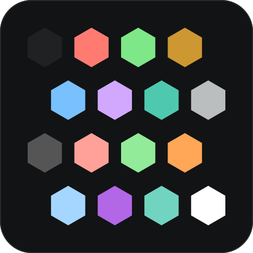

<p align="center">
  
</p>

<h2 align="center">dark-2026</h2>

<p align="center">
  A port of VS Code's <strong>Dark Modern 2026</strong> theme.<br/>
  <em>Red keywords, purple functions, teal types — on a near-black canvas.</em>
</p>

<p align="center">
  
  
  
  
</p>

<p align="center">
  <a href="https://github.com/dark-2026-theme/nvim"><strong>Neovim</strong></a> ·
  <a href="https://github.com/dark-2026-theme/ghostty">Ghostty</a> ·
  <a href="https://github.com/dark-2026-theme/kitty">kitty</a> ·
  <a href="https://github.com/dark-2026-theme/xcode">Xcode</a> ·
  <a href="https://github.com/dark-2026-theme/obsidian">Obsidian</a> ·
  <a href="https://github.com/dark-2026-theme/yazi">Yazi</a>
</p>

---

<p align="center">
  One palette, six targets. <code>:terminal</code> inside Neovim renders identically to<br/>
  the host terminal, because every port reads the same sixteen ANSI values.<br/><br/>
  <strong>#121314</strong> canvas &nbsp;·&nbsp; <strong>638</strong> highlight groups &nbsp;·&nbsp; <strong>28</strong> plugin integrations
</p>

<table align="center">
  <tr>
    <td> Keyword</td>
    <td> Function</td>
    <td> Type</td>
    <td> String</td>
    <td> Number</td>
    <td> Tag</td>
    <td> Param</td>
    <td> Accent</td>
  </tr>
</table>

---

### Ports

| Port | Repository | Status |
|---|---|---|
| **Neovim** | [dark-2026-theme/nvim](https://github.com/dark-2026-theme/nvim) | :white_check_mark: Available |
| **Ghostty** | [dark-2026-theme/ghostty](https://github.com/dark-2026-theme/ghostty) | :white_check_mark: Available |
| **kitty** | [dark-2026-theme/kitty](https://github.com/dark-2026-theme/kitty) | :white_check_mark: Available |
| **Xcode** | [dark-2026-theme/xcode](https://github.com/dark-2026-theme/xcode) | :white_check_mark: Available |
| **Obsidian** | [dark-2026-theme/obsidian](https://github.com/dark-2026-theme/obsidian) | :white_check_mark: Available |
| **Yazi** | [dark-2026-theme/yazi](https://github.com/dark-2026-theme/yazi) | :white_check_mark: Available |

### Palette

The sixteen ANSI colors every port shares:

| | Normal | | Bright |
| --- | --- | --- | --- |
| black | `#202122` | bright black | `#555555` |
| red | `#ff7b72` | bright red | `#ffa198` |
| green | `#7ee787` | bright green | `#91eb99` |
| yellow | `#cd9731` | bright yellow | `#ffa657` |
| blue | `#79c0ff` | bright blue | `#a5d6ff` |
| magenta | `#d2a8ff` | bright magenta | `#b267e6` |
| cyan | `#4ec9b0` | bright cyan | `#71d4c0` |
| white | `#bbbebf` | bright white | `#ffffff` |

Background `#121314`, foreground `#bbbebf`, cursor `#bbbebf`, selection `#276782` on
`#ffffff`. The Neovim port documents the [full palette](https://github.com/dark-2026-theme/nvim#palette),
including UI backgrounds, diagnostics and diff colors.

### Quick start

<details open>
<summary><b>Neovim</b> — lazy.nvim</summary>

```lua
{
  'dark-2026-theme/nvim',
  name = 'dark-2026',
  lazy = false,
  priority = 1000,
  opts = {},
  config = function(_, opts)
    require('dark-2026').setup(opts)
    vim.cmd.colorscheme 'dark-2026'
  end,
}
```

`setup()` is optional — `:colorscheme dark-2026` alone gives you the defaults.

</details>

<details>
<summary><b>Ghostty</b></summary>

```sh
cp themes/dark-2026.conf ~/.config/ghostty/themes/dark-2026
```

```conf
# ~/.config/ghostty/config
theme = dark-2026
```

</details>

<details>
<summary><b>kitty</b></summary>

```sh
cp themes/dark-2026.conf ~/.config/kitty/themes/dark-2026.conf
```

```conf
# ~/.config/kitty/kitty.conf
include themes/dark-2026.conf
```

</details>

<details>
<summary><b>Xcode</b></summary>

```sh
./install.sh
```

Then **Xcode ▸ Settings ▸ Themes** and pick **dark-2026**.

</details>

<details>
<summary><b>Obsidian</b></summary>

```sh
mkdir -p "<vault>/.obsidian/themes/Dark 2026"
cp theme.css manifest.json "<vault>/.obsidian/themes/Dark 2026/"
```

Restart Obsidian, then **Settings ▸ Appearance ▸ Theme ▸ Dark 2026**.

</details>

<details>
<summary><b>Yazi</b></summary>

```toml
# ~/.config/yazi/theme.toml
[flavor]
dark = "dark-2026"
```

</details>

### What the Neovim port gives you

- **638 highlight groups** — editor UI, legacy syntax, tree-sitter, LSP semantic tokens,
  diagnostics, diffs and 28 plugins.
- **Transparency** for the editor, with floating windows controlled separately
  (`styles.floats` = `solid` · `transparent` · `auto`).
- **Per-token styling** — bold/italic/underline across 20 semantic token families.
- **Palette overrides**, static (`palette`) or programmatic (`on_colors`).
- **Highlight overrides**, static (`highlights`) or programmatic (`on_highlights`).
- **Per-plugin opt-out** for every integration.
- Terminal colors (`vim.g.terminal_color_*`) and a **lualine** theme.
- No dependencies. Config errors warn instead of breaking your session.

### Credits

Palette from Microsoft's VS Code **Dark Modern 2026** theme, by way of
[D0nw0r/dark2026.nvim](https://github.com/D0nw0r/dark2026.nvim) (MIT) — the original port
the Neovim plugin is built on.

---

<p align="center"><sub>MIT licensed.</sub></p>
